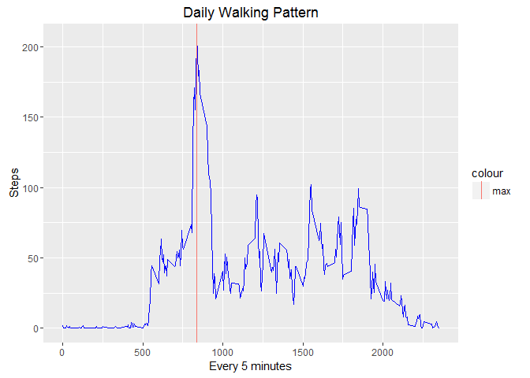

# Reproducible Research: Peer Assessment 1
Jerome Finn  


## Loading and preprocessing the data

```r
activity <- read.csv("./activity.csv", stringsAsFactors=FALSE) 
activity$date <- as.Date(activity$date)
activity$interval <- as.factor(activity$interval)
```
  
### Data loading comments
Assume that the data file is in your home directory.     
We'll use stringsAsFactors=FALSE to make easier to convert to date to a date later. At least for me it seems easier to convert a string to a date than a factor. If the reader knows an easier way please give and example in the comments.  


## What is mean total number of steps taken per day?  
  
### First we calculate the total steps per each day. We'll also calculate the mean and median

```r
library(dplyr)
```

```
## Warning: package 'dplyr' was built under R version 3.2.4
```

```
## 
## Attaching package: 'dplyr'
```

```
## The following objects are masked from 'package:stats':
## 
##     filter, lag
```

```
## The following objects are masked from 'package:base':
## 
##     intersect, setdiff, setequal, union
```

```r
library(ggplot2)
act2 <- activity %>% group_by(date) %>% summarize(steps=sum(steps, na.rm = TRUE))
```
  
### Here we'll graph the historgram with the mean and median shown  
  

```r
a_mean <- mean(act2$steps)
a_median <- median(act2$steps)
g <- ggplot(act2, aes(x=steps )) + geom_histogram(colour="blue", binwidth = 1000)
g <- g + geom_vline(aes(xintercept = a_mean,color="mean"))
g <- g + geom_vline(aes(xintercept = a_median,color="median"))
g + ggtitle("Part 2 - Hist with Mean, Median")
```


   
### The mean and median are displayed below:

```r
a_mean; a_median
```

```
## [1] 9354.23
```

```
## [1] 10395
```
  
## What is the average daily activity pattern?

```r
act3 <- activity %>% group_by(interval) %>% summarize(steps=mean(steps, na.rm=TRUE))
act3$interval <- as.numeric(as.character(act3$interval)) # I get an error trying to make a line plot when it's factor
a_max <- act3$interval[act3$steps==max(act3$steps)]
g <- ggplot(act3, aes(interval, steps)) + geom_line(colour="blue") 
g <- g + ggtitle("Daily Walking Pattern") + xlab("Every 5 minutes") + ylab("Steps") 
g <- g + geom_vline(aes(xintercept = a_max,color="max"))
g 
```


  
The maximum interval is indicated by the red line.  
  
### The maximum number of steps occure at the following interval: 
Maximum interval is: 

```r
a_max
```

```
## [1] 835
```

## Imputing missing values  
### Here are the number of NA values in the data set

```r
sum(is.na(activity$steps))
```

```
## [1] 2304
```
  
### Filling in values  

Here we will calculate the mean for each interval and insert that number into any interval with NA values.  
We will round the number to the nearest whole number.  
The results will be in a new data table DT


```r
library(data.table)
```

```
## Warning: package 'data.table' was built under R version 3.2.4
```

```
## 
## Attaching package: 'data.table'
```

```
## The following objects are masked from 'package:dplyr':
## 
##     between, last
```

```r
DT <- data.table(activity)
DT[,inter_mu:= mean(steps, na.rm=TRUE), by=interval]
DT$steps[is.na(DT$steps)] <- round(DT$inter_mu)
```

```
## Warning in DT$steps[is.na(DT$steps)] <- round(DT$inter_mu): número de items
## para para sustituir no es un múltiplo de la longitud del reemplazo
```
  
### Now we graph the new data with no NA  
Notice the that distribution is closer to the center and the mean and the median are so close that their lines overlap. 


```r
act4 <- DT %>% group_by(date) %>% summarize(steps=sum(steps, na.rm = TRUE))
a4_mean <- mean(act4$steps)
a4_median <- median(act4$steps)

g <- ggplot(act4, aes(x=steps )) + geom_histogram(colour="blue", binwidth = 1000)
g <- g + geom_vline(aes(xintercept = a4_mean,color="mean"))
g <- g + geom_vline(aes(xintercept = a4_median,color="median"))
g + ggtitle("Part 4 - Hist with Mean, Median")
```


  
Here we see that mean and median are different from the previous distribution and are almost same, although this could be just coicidence as there is no reason to assume a normal distribution here.  


```r
a4_mean; a4_median
```

```
## [1] 10765.64
```

```
## [1] 10762
```


## Are there differences in activity patterns between weekdays and weekends?  
  
### Here we create the factor variable  

My system is set to Spanish so I have to check for Saturday and Sunday in that lanuage.  


```r
activity$weekday[weekdays(activity$date) == "domingo" | weekdays(activity$date) == "sábado"] <- "weekday"
activity$weekday[weekdays(activity$date) != "domingo" & weekdays(activity$date) != "sábado"] <- "weekend"
activity$weekday <- as.factor(as.character(activity$weekday))
```
  
### Create the time series plot by weekday and weekend


```r
act5 <- activity %>% group_by(weekday, interval) %>% summarize(steps=mean(steps, na.rm=TRUE))
act5$interval <- as.numeric(as.character(act5$interval)) # I get an error trying to make a line plot when it's factor
g <- ggplot(act5, aes(interval, steps)) + geom_line(colour="blue") + facet_grid(weekday ~ .)
g + labs(title = "Weekday, Weekend Walking Patterns", x="5 minute intervals", y="Steps Every 5 minutes") 
```


### Conclusion  

On weekdays a little before interval 1000, people are not taking as many steps as on the weekend.  
This seems logical since on the weekdays many people have to go to work in an office and sit around and do things, like programming. 


